# Technical task | ERP.AERO | Node.js dev

## Make a service with REST API

### Install Environment

```yml
node.js version: v22.13.1
```

### Install Dependencies

```
npm i
```

### Environment Variables

create a `.env` file in the root folder

```yaml
PORT=PORT_NUMBER
DB_HOST=DB_HOST
DB_USER=USER_NAME
DB_PASSWORD=PASSWORD
DB_NAME=DB_NAME
JWT_SECRET=YOUR_SECRET
JWT_REFRESH_SECRET=YOUR_REFRESH_SECRET
FILE_UPLOAD_PATH=UPLOAD_PATH
```

### Run project

Please refer to the `scripts` part of **./package.json** file:

```json
"start": "node src/index.js",
"dev": "nodemon src/index.js"
```

### Visit

- http://localhost:5680

---

- http://localhost:5680/signup

## 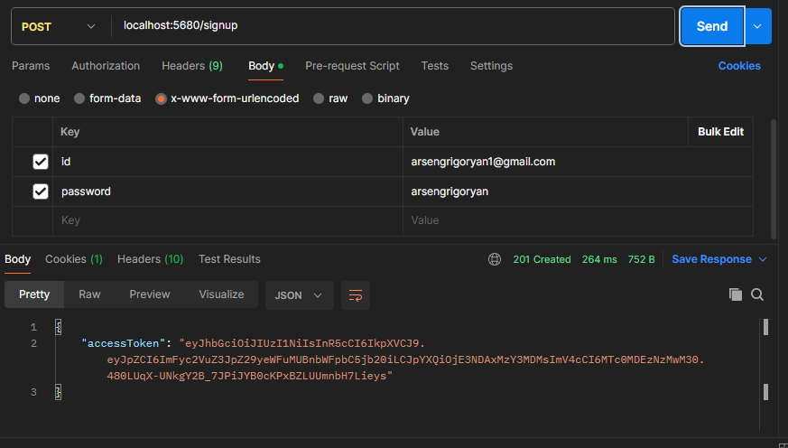

- http://localhost:5680/signin

## 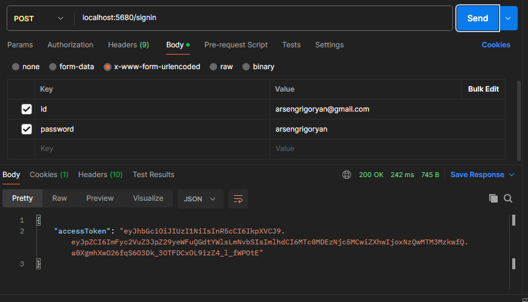

- http://localhost:5680/signin/new_token

## 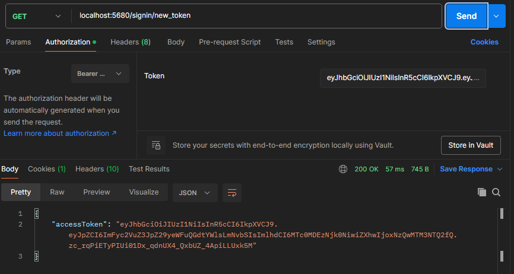

- http://localhost:5680/info

## 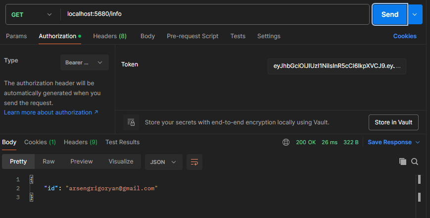

- http://localhost:5680/logout

## 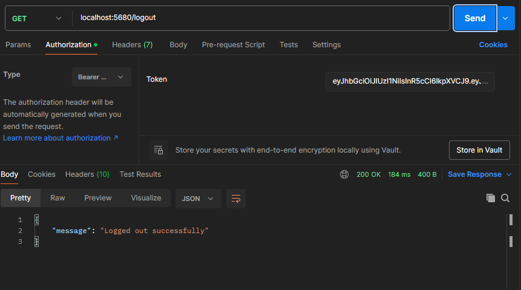

- http://localhost:5680/file/upload

## 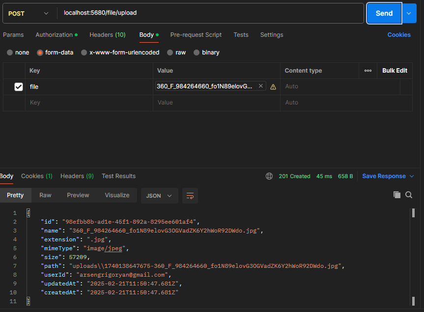

- http://localhost:5680/file/list

## 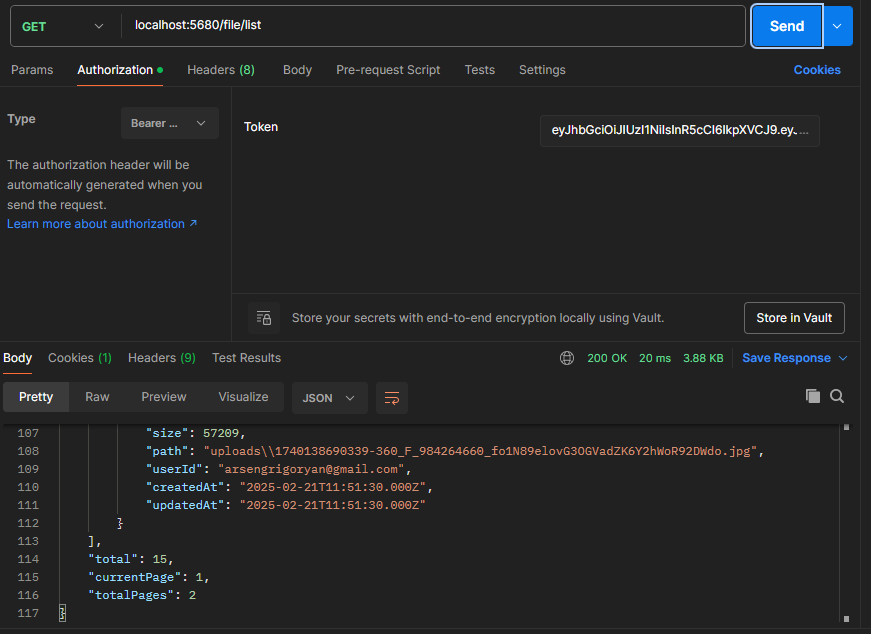

- http://localhost:5680/file/list?page=2&list_size=5

## 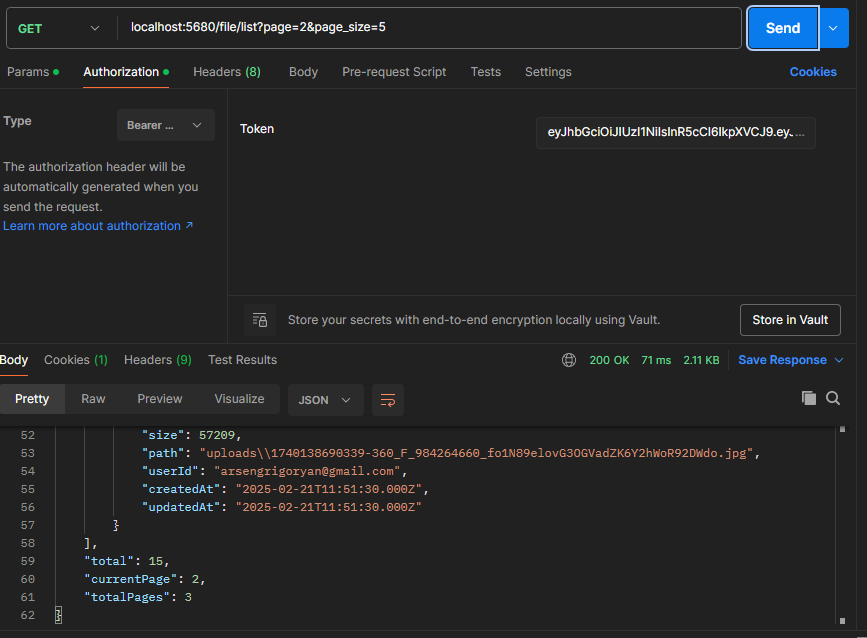

- http://localhost:5680/file/:id

## 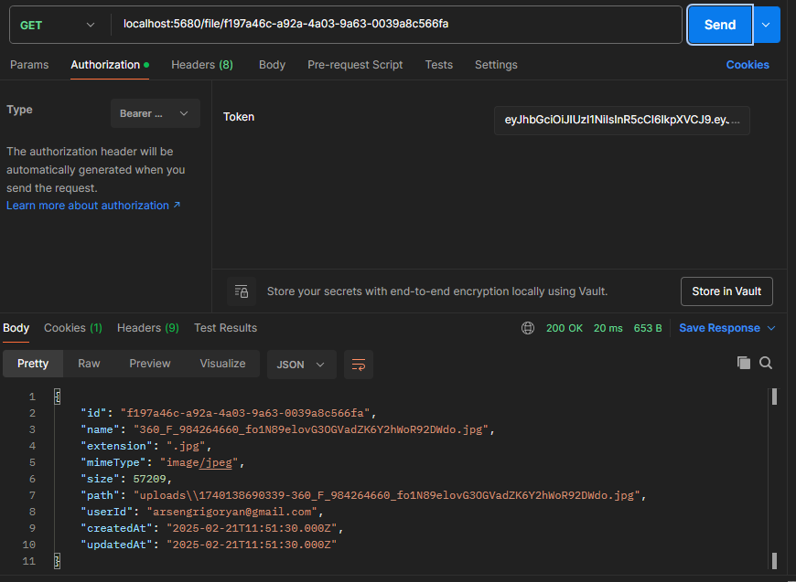

- http://localhost:5680/file/download/:id

## 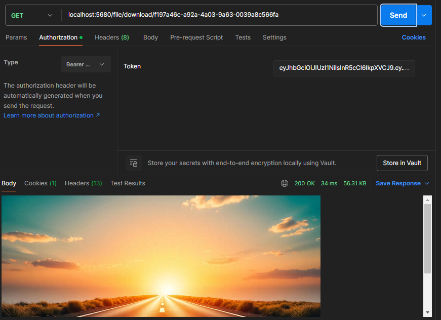

- http://localhost:5680/file/update/:id

## 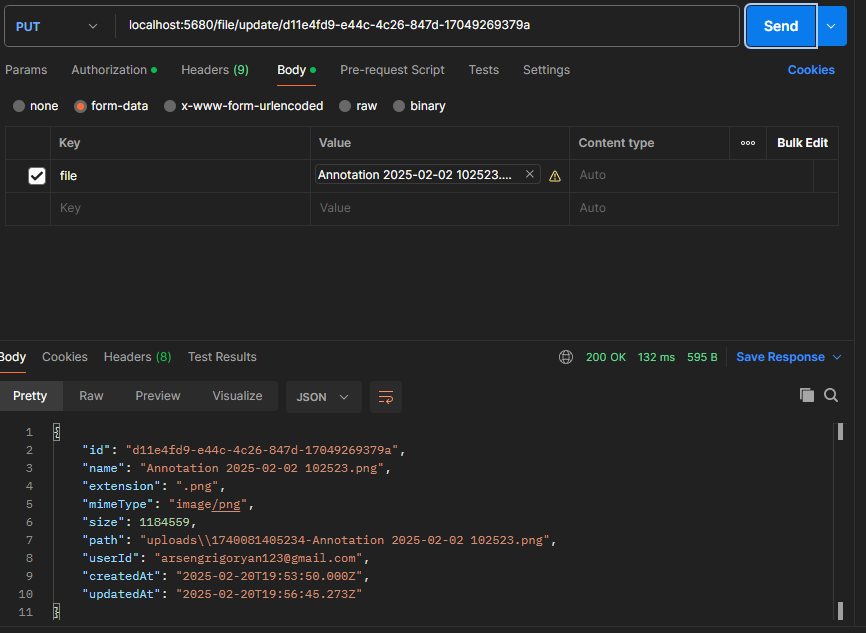

- http://localhost:5680/file/delete/:id

## 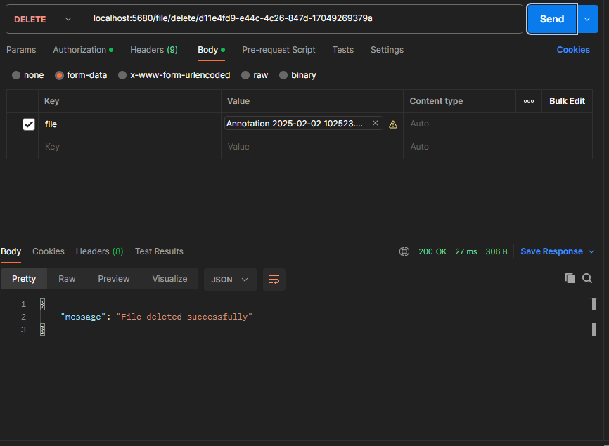

---

&copy; 2025 Arsen Girgoryan.

All Rights Reserved.
